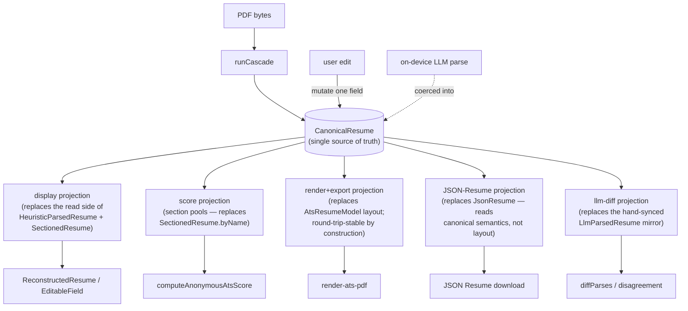

# Canonical résumé model — target representation + staged migration plan (#439)

Design for [#439](https://github.com/resumelint-org/resumelint/issues/439), the follow-up to the architecture decision in [#438](https://github.com/resumelint-org/resumelint/issues/438) ("one canonical representation, staged").

**Status:** design only — no production code changed by this issue (acceptance criterion). Implementation lands as the sequenced, per-stage follow-up issues at the end of this doc. Each stage is separately reviewable and keeps the round-trip invariant green; **nothing here is a big-bang PR.**

**Baseline the design is written against:** `main` as of the mapping in this doc. All `file:line` citations are against that baseline. `ATS_SCORE_ALGO_VERSION` is `"1.4"` (`src/lib/score/score.ts:73`); [#435](https://github.com/resumelint-org/resumelint/issues/435) bumps it to `1.5` in flight — the cache-version hook in §6 keys off whatever value is current at each stage's cutover, not a pinned literal.

---

## 0. The thesis, restated precisely

We carry **five** parallel shapes for the same underlying résumé, and every adjacent pair needs a hand-written adapter kept in lockstep by hand:

| # | Shape | Home | Role |
|---|---|---|---|
| 1 | `HeuristicParsedResume` / `CascadeResult` | `heuristics/types.ts:121` / `:174` | what the parser produces |
| 2 | `SectionedResume` | `heuristics/sections.ts:85` | section pools the scorer + editor grade from |
| 3 | `LlmParsedResume` | `webllm/parse-resume.ts:56` | on-device LLM parse, **field names hand-synced** to #1 |
| 4 | `AtsResumeModel` / `AtsEntry` / `AtsSection` / `AtsEntryFields` | `pdf/ats-resume-model.ts:181` / `:114` / `:173` / `:87` | render + PDF-export model |
| 5 | `JsonResume` | `pdf/to-json-resume.ts:113` | JSON Resume export |

The decision (#438) is to collapse these toward **one canonical internal model** with **thin projections** (display / score / render+export / JSON-Resume / llm-diff) derived off it, retiring the N hand-written adapters and the `apply-overrides` lockstep. This doc says *what the canonical model is* and *how we reach it in green stages*.

Two structural costs the canonical model must dissolve, not just relocate:

- **Cost 1 — N peer shapes, N hand-sync adapters.** `apply-overrides.ts` is the sharpest tell: `ApplyOverridesResult` (`edit/apply-overrides.ts:52`) must return `parsed` **and** `rawText` **and** `sections` **and** `fieldConfidence` **together**, because one un-mirrored user edit re-grades or re-parses wrong (comments cite [#133](https://github.com/resumelint-org/resumelint/issues/133), [#421](https://github.com/resumelint-org/resumelint/issues/421) Blocking #1/#3). The `LlmParsedResume` hand-sync note (`parse-resume.ts:52-54`: *"Keep field names in sync with that interface"*) is the same cost in a second place.
- **Cost 2 — the render model encodes re-parse invariants.** `AtsEntry` is doing triple duty (display, PDF layout, **and** export hint via `AtsEntryFields`). Its layout fields exist to satisfy the parse→export→parse identity: `headerLineDate` (#425/#302 entry-boundary date cue), `subLineDate` (#425, avoids the #298 title↔company re-parse swap), `atomicSegments` (#301 skills-middot atomicity), `headerBold` (#425) — each documented in terms of how the exported PDF must re-parse (`ats-resume-model.ts:118-158`). So the renderer knows parser internals, and a fidelity fix touches model + renderer + the parser exemption it leans on + regenerated corpus goldens — four surfaces **by construction**. That is why #425/#434/#435 each landed at 40–54 files.

---

## 1. The five shapes today (grounded inventory)

### 1 · `HeuristicParsedResume` + `CascadeResult`
- `HeuristicParsedResume = Partial<ParsedResume> & { skills; experience; education; phoneIsValid? }` — `heuristics/types.ts:121`. `phoneIsValid?` (`:126-129`) precomputes libphonenumber `isValid()` so the scorer skips importing `libphonenumber-js` (entry-chunk budget).
- `CascadeResult` — `heuristics/types.ts:174`: `parsed`, `rawText` (`:185`), `markdown?` (`:188`), **`sections: SectionedResume`** (`:194`, cites [#132](https://github.com/resumelint-org/resumelint/issues/132) — replaces the retired `skillsSectionText` side-channel), `linkAnnotations`, `diagnostics.sectionSource`, `timings`.

### 2 · `SectionedResume`
- `heuristics/sections.ts:85` (cites #127 §2.1, #132). `byName: ReadonlyMap<SectionName|"profile", readonly string[]>` (`:89`), `accomplishmentSections` (`:90`, *not yet consumed by pool sourcing*), `sectionHeadings?` (`:94`, #285), `source: "markdown"|"regex"` (`:101`). Built by `toSectionedResume` (`sections.ts:122`) over `PdfSection` (`:62`).

### 3 · `LlmParsedResume`
- `webllm/parse-resume.ts:56`. Fields mirror the heuristic parser **by hand** (`:52-54`) so the disagreement detector can diff field-by-field ([#242](https://github.com/resumelint-org/resumelint/issues/242)). No converter exists between #1 and #3 — the "adapter" is the intentional structural mirror; `diffParses(heuristic, llm)` at `heuristics/disagreement.ts:186` consumes both.

### 4 · `AtsResumeModel`
- `pdf/ats-resume-model.ts:181` (`sections: AtsSection[]` `:188`). `AtsSection` `:173`; `AtsEntry` `:114` with the four round-trip-encoding layout fields above; `AtsEntryFields` `:87` (machine-readable mirror; *"Display/render code never reads this"* `:160`). Built by `buildAtsResumeModel(result, score, edit?)` — `ats-resume-model.ts:425`; date-slot routing to `headerLineDate`/`subLineDate` at `:597-613` cites #425/#302. Round-trip-tradeoff note at `:469`.

### 5 · `JsonResume`
- `pdf/to-json-resume.ts:113` (jsonresume.org v1.0.0). Produced by `toJsonResume(model: AtsResumeModel)` — `to-json-resume.ts:409` — a **pure** `(model) => JsonResume` adapter (`:5-13`, no `pdf-lib`, no I/O). So JSON-Resume export today reads the **render** model, inheriting its layout coupling.

### Adapter chain today
```
PDF ─ runCascade ─▶ CascadeResult ──buildAtsResumeModel──▶ AtsResumeModel ──toJsonResume──▶ JsonResume
                        │  ▲                                    │
                        │  └── applyOverrides (edit) ───────────┘ (re-derives parsed+rawText+sections+fieldConfidence)
                        └── (mirror, no converter) ──▶ LlmParsedResume ──diffParses──▶ disagreement
```

---

## 2. Target representation

### 2.1 The canonical model + projections

One canonical internal shape, `CanonicalResume`, is the **single source of truth**. Every other shape becomes a **projection** — a pure `(CanonicalResume) => T` function, never a peer shape hand-synced back.



### 2.2 What each of today's five shapes becomes

| Today | Becomes | Note |
|---|---|---|
| `HeuristicParsedResume` | the **field core** of `CanonicalResume` | cascade writes it once; nothing else is a peer copy |
| `SectionedResume` | the **section-membership core** of `CanonicalResume` + a `score` projection | section membership is a property of the model, not re-derived from `rawText` downstream |
| `LlmParsedResume` | an **input coercion** into `CanonicalResume` + an `llm-diff` projection | the hand-sync note (`parse-resume.ts:52-54`) is deleted — diff reads a projection of the canonical model, not a parallel type |
| `AtsResumeModel` (`AtsEntry` layout fields) | a **render+export projection** | the four re-parse-encoding fields (`headerLineDate`/`subLineDate`/`atomicSegments`/`headerBold`) move **behind** the projection; see §3 |
| `JsonResume` | a **JSON-Resume projection off canonical semantics** | stops reading the render model, so it no longer inherits layout coupling |

### 2.3 Where `apply-overrides` lands
One user edit mutates **one** field on `CanonicalResume`. `parsed` / `rawText` / `sections` / `fieldConfidence` stop being lockstep return values and become projections read on demand. `ApplyOverridesResult` (`apply-overrides.ts:52`) collapses to `CanonicalResume` (or a thin `{ model }`); the #133 "re-grade a live bullet edit" and #421 "fieldConfidence in step" requirements are satisfied because the projections are *derived*, not *mirrored*.

---

## 3. Where the round-trip invariant lives

Today the invariant lives in the **renderer** — `AtsEntry`'s layout fields are shaped so the exported PDF re-parses to the same fields (`ats-resume-model.ts:118-158`, `:469`; tests `corpus-roundtrip.test.ts` #293 `:303`, `render-roundtrip.repro.test.ts` #284 `:69`). That is Cost 2: the renderer must know parser internals.

**Target:** the invariant is a property of `CanonicalResume`. The render+export projection is derived from the canonical model and is round-trip-stable **by construction**, so:
- the renderer draws from an already-stable shape and stops encoding date-cue / title↔company-swap / middot-atomicity rules (#425/#298/#301/#302 move behind the projection boundary);
- a fidelity change edits the projection (or the canonical field it reads), **not** model + renderer + parser-exemption + goldens as four coupled surfaces.

The parser-side exemption that today backstops flush-right dates — `columnGapCuts` + `isLoneDateRange` (`sections.ts:264-277`) — becomes an assertion the canonical model satisfies, rather than a rule the renderer must not violate.

---

## 4. Staged migration plan

Ordered stages. **Each stage keeps `corpus-roundtrip.test.ts`, `render-roundtrip.repro.test.ts`, and the golden snapshots green** — no half-baked intermediate state. Stages are **additive**: the present `AtsResumeModel` shape stays live until the final cutover, so in-flight fidelity PRs (#435 and successors) keep landing and migrate only at cutover.

### Stage A — Split export-semantics from layout inside `AtsEntry`
Extract `AtsEntryFields` (`ats-resume-model.ts:87`) into a standalone export-semantic projection so `toJsonResume` (`to-json-resume.ts:409`) reads **semantic** fields, not the render model's layout hints (`headerLineDate`/`subLineDate`/`atomicSegments`/`headerBold`). After this, a layout tweak cannot ripple into export mapping.
- **Round-trip story:** JSON-Resume output byte-identical (the projection reads the same values `AtsEntryFields` already held); corpus + render round-trip untouched (layout fields unmoved). Pure extraction.
- **Blast radius:** `ats-resume-model.ts`, `to-json-resume.ts`, their tests. Small.

### Stage B — Introduce `CanonicalResume`, cascade writes it, projections read it
Define `CanonicalResume` (field core from `HeuristicParsedResume` + section core from `SectionedResume`). `runCascade` populates it alongside `CascadeResult`. Add **display** and **score** projections; point the scorer + `ReconstructedResume` at the projections. `CascadeResult` stays as a compatibility façade over the canonical model.
- **Round-trip story:** score output and golden snapshots unchanged (projections reproduce `sections.byName` pools exactly — assert equality against the current `SectionedResume` in the stage's tests). No render/export change.
- **Blast radius:** new `canonical.ts`, `cascade.ts` wiring, `score.ts` + `ReconstructedResume` read-site swap. Medium.

### Stage C — Move the round-trip invariant onto the canonical model
Make the render+export projection derive from `CanonicalResume` and be round-trip-stable by construction (§3). Renderer draws from the projection; `buildAtsResumeModel` (`ats-resume-model.ts:425`) becomes `canonical → render-projection`.
- **Round-trip story:** this is the delicate stage — land it behind the projection with the corpus + render round-trip tests as the gate, and only flip the renderer's source once the projection reproduces every current golden. The `columnGapCuts`/`isLoneDateRange` exemption (`sections.ts:264-277`) becomes a canonical-model assertion.
- **Blast radius:** `ats-resume-model.ts`, `render-ats-pdf.ts`, projection module, goldens. Medium-large, but **one-time** — it buys down every future fidelity PR.

### Stage D — Collapse the remaining peer shapes + retire hand-sync
Retire `LlmParsedResume` as a peer type: coerce LLM output into `CanonicalResume`, make `diffParses` (`disagreement.ts:186`) read the llm-diff projection. Delete the `parse-resume.ts:52-54` hand-sync note. Collapse `ApplyOverridesResult` (`apply-overrides.ts:52`) to `CanonicalResume`; `parsed`/`rawText`/`sections`/`fieldConfidence` become projections (§2.3).
- **Round-trip story:** disagreement output and edit re-grade behavior unchanged (projections reproduce the mirrored fields); assert against current `diffParses` + `applyOverrides` results.
- **Blast radius:** `parse-resume.ts`, `disagreement.ts`, `apply-overrides.ts`, callers. Medium.

### Stage E — Cutover + cache migration
Remove the `CascadeResult` compatibility façade; canonical model is the only shape. Ship the #321 cache versioning (§6). This is the only stage that touches persisted state.

Per-stage implementation issues are minted from **this** list once it's fixed — not before (§9).

---

## 5. "Typical fidelity change" file-count target

- **Baseline (pre-refactor):** #425/#434/#435 = **40–54 files** per export/parse fidelity change.
- **Target (post-Stage C):** a typical fidelity change touches **≤ 8 files** — the render+export projection (+ its test) and, when the change is semantic, the canonical field it reads (+ test). Regenerated corpus goldens are counted separately (they are generated, not authored) and should shrink because the change is local.
- **How we'll know it worked:** the first fidelity fix that lands *after* Stage C is measured against this bar; if it still sprawls to 40+ files, Stage C didn't dissolve the coupling and the plan is wrong.

---

## 6. Hard constraint — #321 parse-result cache

The `resumes` IndexedDB store caches a **pre-canonical `CascadeResult`**: `SavedResumeSnapshot { result: CascadeResult; score; sourceKind }` (`resume-library.ts:37`), written in `saveResumeToLibrary` (`:90-99`), read via `readSnapshot` (`:66`); it round-trips through IndexedDB structured clone, which preserves the `sections` `Map` (`:6-13`, #321).

Any stage that changes the **persisted** shape (Stage E, and Stage B if the façade is persisted) MUST invalidate or migrate that cache — not only the in-memory model + corpus goldens. **Cheapest hook:** version the cached record by `ATS_SCORE_ALGO_VERSION` (`score.ts:73`, currently `"1.4"`, →`1.5` via #435) **plus a new parser-shape version constant**, so a representation change auto-invalidates on read and re-parses from the stored PDF `Blob` (#321 keeps the blob). A stale-shape read must **re-parse**, never silently deserialize an old shape into the canonical model. Refs [#321](https://github.com/resumelint-org/resumelint/issues/321), [#401](https://github.com/resumelint-org/resumelint/issues/401).

---

## 7. Hard constraint — header-vs-entry regression case (with a correction)

**Correction to #438/#439 as written.** Both issues cite `classifyLine` at `sections.ts:1854` with `lineLooksLikeDatedEntry = hasDateRange(line) || hasDateRange(nextLine)`. That identifier and that `hasDateRange` function **do not exist in the codebase.** `classifyLine` is really at `sections.ts:1829`; line 1854 sits inside its `isInstitutionRepeat` suppression branch. The **actual** one-line `Title  Dates` header-vs-entry mechanism is the #425 flush-right-date exemption in `columnGapCuts`:

```ts
// sections.ts:264-277
if (cuts.length > 0 &&
    isLoneDateRange(mergeItemText(sorted.slice(cuts[cuts.length - 1])))) {
  cuts.pop();   // trailing lone-date segment stays merged into its org text
}
```

The *problem class* named in #438 is real — "is this line a category header or a dated entry?" is decided from **adjacent raw-line signals** (`isLoneDateRange` on the trailing segment) rather than from a structured field on a canonical model. The cited symbol is just wrong.

**Acceptance test the canonical model must pass:** a one-line `Title  Dates` role under a section header routes as a **dated entry**, not a sub-section boundary, with the header-vs-entry call keyed off a **derived** `isDatedEntry` predicate over the entry's structured dates — not off `isLoneDateRange`/`hasDateRange` re-scanning neighboring raw lines.

> **§7 correction (folded in at Stage C, #444).** Earlier this read "keyed off a structured `isDatedEntry` **property** on `CanonicalResume`." That over-specified: the structure (`start_date` / `end_date` + precision) is **already** on the entry (`fields.experience[]` / `fields.education[]`). A stored `isDatedEntry` field would be a second entries representation parallel to the field core — exactly the parallel-shape lockstep cost this epic removes (considered and **rejected** via `/clarify`, 2026-07-11). So `isDatedEntry` is a **derived predicate** — `Boolean(start_date || end_date)` — over the dates the entry already holds (`isDatedEntry` in `pdf/ats-resume-model.ts`), never a new core or field. It answers §7's coarse "is this a dated entry at all"; the finer flush-right routing (`headerLineDate` / `subLineDate`) stays on `isLoneDateRange` over the *formatted* range, a render-shape concern Stage C keeps byte-identical.

Capture it as a fixture + assertion at Stage C (where the render+export projection takes over) and carry it green through Stage E.

---

## 8. Non-goals

- No parser-heuristic **accuracy** rewrite — this is representation/coupling only (#438).
- No code migration **in #439** — this issue produces the diagram + plan; implementation is the per-stage follow-ups.
- Stages A–D are additive; **in-flight fidelity work (#435 and successors) is not blocked** and migrates only at the Stage E cutover.

---

## 9. Per-stage follow-up issues to mint (from §4)

Minted **after** this plan is accepted, one per stage, each with its round-trip-invariant story as an explicit acceptance criterion:

1. **Stage A** — extract `AtsEntryFields` export-semantic projection out of `AtsEntry` layout hints. *(smallest; good first cut / intern-sized.)*
2. **Stage B** — introduce `CanonicalResume`; cascade writes it; display + score projections; `CascadeResult` as façade.
3. **Stage C** — move the round-trip invariant onto the canonical model; renderer draws from the projection. *(carries the §7 header-vs-entry acceptance test.)*
4. **Stage D** — collapse `LlmParsedResume` + `ApplyOverridesResult` into projections; delete the hand-sync note.
5. **Stage E** — cutover + #321 cache versioning/invalidation (§6).

Refs [#438](https://github.com/resumelint-org/resumelint/issues/438), [#321](https://github.com/resumelint-org/resumelint/issues/321), [#401](https://github.com/resumelint-org/resumelint/issues/401), [#425](https://github.com/resumelint-org/resumelint/issues/425), [#434](https://github.com/resumelint-org/resumelint/issues/434), [#435](https://github.com/resumelint-org/resumelint/issues/435).
